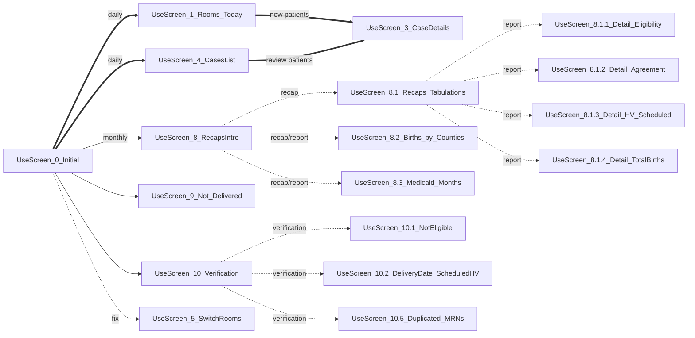

Contents
========

* [Introduction](#Introduction)
* [Summarized Screens Diagram](#Summarized_Screens_Diagram)
* [Process Patients Occupying Rooms](#Process_Patients_Occupying_Rooms)
* [Process Contact and Recruitment](#Process_Contact_and_Recruitment)
* [Cases List Screen](#Cases_List_Screen)
* [Tabulations and Recaps](#Tabulations_and_Recaps)
* [Switch Rooms Screen](#Switch_Rooms_Screen)
* [Conclusion](#Conclusion)

## Introduction

The PowerApps Recruitment application is a tool designed to collect information on new births for the purpose of scheduling a home visit by a certified nurse around three weeks after birth. This application was developed to streamline the process of scheduling home visits and to ensure that all information related to mothers on birth (MOB) is safely stored in a central location and properly updated.

## Summarized_Screens_Diagram

The next diagram shows a summarized version of the screens flow. The bold arrows represent the most frequently used procedures.

<!--UseScreen_0_Initial== follow ==>UseScreen_1_Rooms
* [Feature:_Access_Restriction_to_One_User_at_a_Time](#Feature:_Access_Restriction_to_One_User_at_a_Time)
UseScreen_0_Initial-. follow .->UseScreen_2_SupplemRooms   
UseScreen_0_Initial-. follow .->UseScreen_2_SupplemRooms
UseScreen_0_Initial-. follow .->UseScreen_6_CasesTable
UseScreen_0_Initial-. follow .->UseScreen_7_CasesNotes
UseScreen_2_SupplemRooms-. follow .->UseScreen_3_CaseDetails
UseScreen_10_Verification-. verification .->UseScreen_10.3_NotAgreedNotEligible
UseScreen_10_Verification-. verification .->UseScreen_10.4_Delete_Names_Locking_Rooms
-->

## Process_Patients_Occupying_Rooms

The app features an entry screen displaying a list of hospital rooms, and the users utilize this screen to access the case details for each patient via a dedicated form. At the start of the working day, supervisors input the name, date of birth, and contact information of patients currently occupying rooms. This information is extracted from the hospital system, and for each patient, a new record is created in the database, which is a SharePoint list.

### Image: Home Screen
{: width=100% }
_Home Screen_

The different colors on the small left bar represent case statuses: green if the case was open on that day and it’s complete, red if it was opened that day but it has pending information to complete, and blank if it was open on a previous day.

### Image: Rooms Today
{: width=100% }
_Rooms Today_

## Process_Contact_and_Recruitment

Once that first process is completed by the supervisors, a team of recruiters contacts all mothers on birth (MOBs) during the day and registers the outcomes. Additional information is filled out: eligibility, availability, insurance, address, mom’s and baby’s health, and other fields about the birth process. The recruiters then schedule a home visit date and time, or they indicate if the MOB did not agree to a visit or if they were not contacted.

If the MOB is not anymore in the room, the 'Room Occupied' field changes to 'N', and after saving, a new record with the same Room number is automatically created to be filled with the next case info.

Simultaneously, the previous records for those rooms are automatically marked as "not occupied" but remain accessible for editing through the "Cases List" screen, enabling easy navigation to those cases.

### Image: Form Details

{: width=100% }
_Form Details_

## Cases_List_Screen

As the 'Rooms_Today' screen only lists the cases with patients currently occupying rooms, the 'Case Details' screen allows users to find cases from previous days. This screen has options to filter the list by period (Start - End dates), Room Occupied, Eligibility, and Agreement. The gallery also shows cases with missing information (highlighted in red).

### Image: Cases List

{: width=100% }
_Cases List: Third record from the Top is locked by a user currently working on record._

### Feature: Access_Restriction_to_One_User_at_a_Time

In order to prevent loss of information, the application restricts the case details screen use to one patient at the same time. To do so, whenever a user enters the case detail screen, a new record is registered in another SharePoint list named “In_Out_Data”. The user name on this record is listed in the rooms list screen so the other users can see that the specific room is currently underwork of that first user, and the entry to that room is meanwhile locked. When the user leaves the room, the record in the list “In_Out_Data” is deleted and the entry to that room is unlocked for other users.

## Tabulations_and_Recaps

The application has also a tabulations' screens that provide needed information about monthly recaps on the number of MOBs contacted, eligibility, how many agreed to a home visit, and other summary information, such as the number of MOBs per county or under Medicaid.

### Image: Tabulations

Each of the numbers showed in the recap triggers another screen with a list of cases totaling that number, for verification.

{: width=100% }
_Tabulations: Recap of Patients by Outcomes._

### Image: Births by Counties

Count of births by Mother's county of residence.

{: width=100% }
_Tabulations: Recap of Births by Counties._

## Switch_Rooms_Screen

Additionally, there are also screens that help to keep data consistency, quality of the information and the accuracy of the resulting reports: screen that list two cases for the same patient, mothers without delivery, differences in days between scheduled home visit dates and delivery dates, etc. 

Whenever the mothers change rooms, for instance because they began to labor, or for other reasons, a special screen “Switch Rooms” is available for that purpose, with access restricted to supervisors only. That way, an already filled form flagged as an 'Unoccupied' on a previous day, can be reused again within the new room. 

### Image: Switch Rooms Screen

{: width=100% }
_Switch Rooms Screen._

## Conclusion:

The Recruitment application in PowerApps is an effective tool for collecting information on new births and scheduling home visits by certified nurses. It provides a streamlined process for registering information, reducing the need for manual data entry as it was previously using a spreadsheet. With its user-thought interface and centralized database, it provides a streamlined process for tracking MOBs and their home visits.  Finally, the summary reports in real-time provide valuable insights about the operations that can be used to optimize them and measure the impact of this service on the community.

<!-- Screens_Diagram {: width=100% }_Screen_Flow_ -->

