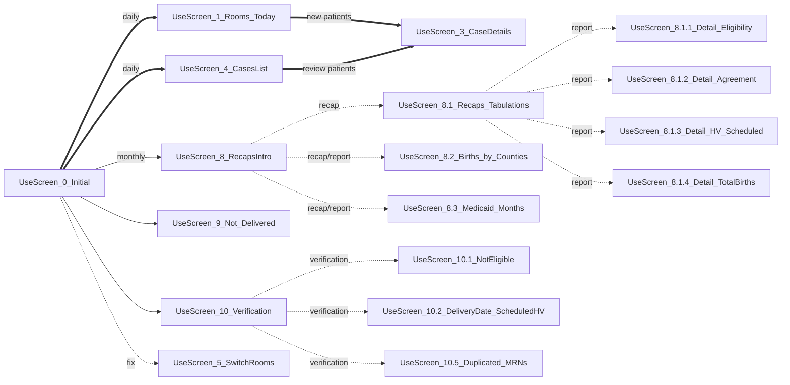

Contents
========

* Introduction
* Summarized App Screens Diagram
* Data Tables
* 01 Home Screen
* 02 Screen Occupied Rooms
* 03 Screen Case Details
* 04 Screen Cases List
* 05 Screen Tabulations and Recaps
* Switch Rooms Screen
* Conclusion

<!--
* [Introduction](#Introduction)
* [Summarized Screens Diagram](#Summarized_Screens_Diagram)
* [01 Home Screen](#01_Home_Screen)
* [02 Screen Occupied Rooms](#02_Screen_Occupied_Rooms)
* [03 Screen Case Details](#03_Screen_Case_Details)
* [04 Screen Cases List](#04_Screen_Cases_List)
* [05 Screen Tabulations and Recaps](#05_Screen_Tabulations_and_Recaps)
* [Switch Rooms Screen](#06_Screen_Switch_Rooms)
* [Conclusion](#Conclusion)
-->

## Introduction   <!--Reviewed 2023-08-03 -->

The "Newborns Follow-up" app is a tool designed to collect and store information on new births for the purpose of scheduling a home visit some weeks after the birth.

This application provides users with an intuitive interface to maintain the information in a database, identify cases that require attention or additional updates, and summarize groups of cases based on different characteristics or outcomes. <!--rev. 8/2/23-->

For proper control, flow, and storage of the information, a total of 18 global variables, 122 context variables, and 60 collections were defined. This article will show only a broad overview of the main processes, taking some lines of code as samples of operations, explaining then in a generic way to see their replicability in other similar situations.


## Summarized App Screens Diagram   <!--Reviewed 2023-08-03 -->

The next diagram shows a summarized version of the screens flow. The bold arrows represent the most frequently used procedures.




## Connected Data Tables   <!--Reviewed 2023-08-03 -->

In this case, the app is supported by SharePoint lists within the same MS Environment, which provides controlled user access. The following is a description of each one:

- Recruitment_Data
: It contains the case details as records with the fields: Case ID, Mother info, birth info, contact, and outcomes. There are nearly 50 fields in this data table.

- Activity Log
: Every time a user interacts with the app by visiting specific screens, this Log registers the user name, entry time, exit time, case id, and app version. The purpose is to verify the correct functioning. 

- In_Out_Data 
: To prevent having two users working on the same case at the same time, this table registers that a user is currently working on a case, so every time a user tries to open a case, verification over this data is performed, and if the case is currently under ongoing work, the access to the case is blocked until the first user leaves the case details screen. The app creates a new record per ongoing work and deletes the record when that work is finished.

- PowerApps Versions
: This data keeps the names of the organization apps and the last update date and time. If an update is published, and the user is working with a previous version, a message will pop up to let the user know that an update is needed by refreshing the browser.


## 01 Screen: Home Screen    <!--Reviewed 2023-08-03 -->

The home screen shows the access to all the groups of screens, either the operational to input data, or the evaluation and verification screens, to take out information and ensure data consistency. 

### Image: Home Screen
{: width=100% }<!--{: width="432" height="205" }-->
_Home Screen_

### Code Snippet: Filter a Gallery with values contained in a table.

To create the menu of screens, in the _OnVisible_ screen property, a table with two fields: "Screen" and "screen name" is defined and then assigned to a context variable _tscreensgallery1_. This variable will serve as the _Items_ gallery property: 

```
UpdateContext({tscreensgallery1:
    Table(
        {Screen: "ROOMS SUPP TODAY",         screenname: Screen_1_Rooms},
        {Screen: "ROOMS SUPPLEMENTAL BIRTHS",screenname: Screen_2_SupplemRooms},
        {Screen: "CASES LIST",               screenname: Screen_4_CasesList},
        {Screen: "SWITCH ROOMS",             screenname: Screen_5_SwitchRooms}
        )});

```
<!--
Resulting Table: 

| Screen                       | screenname             | Country |
|:-----------------------------|:-----------------------|--------:|
| ROOMS TODAY                  | Screen_1_Rooms         | Germany |
| ROOMS SUPPLEMENTAL BIRTHS    | Screen_2_SupplemRooms  | UK      |
| CASES LIST                   | Screen_4_CasesList     | Italy   |
| SWITCH ROOMS                 | Screen_5_SwitchRooms   | Italy   |
-->

So each time a user select a button on the gallery, the app will navigate to the corresponding screenname, using the property _OnSelect_.

```
Navigate(ThisItem.screenname,ScreenTransition.Fade)
```

## 02 Screen: Occupied Rooms           <!--Reviewed 2023-08-03 -->

The app features an entry screen displaying a list of rooms, and the app users utilize this screen to access the case details for each patient via a dedicated form on the screen _Case Details_. At the start of the working day, the app user input the name, date of birth, and contact information of patients currently occupying rooms. This information is extracted from the hospital system, and for each patient, a new record is created in the database, which is a SharePoint list. Some of the rooms are left "empty", meaning no patient is occupying the room that day.

### Image: Rooms Today
{: width=100% }
_Rooms Today_

### Code Snippet: Color of Indicator by Case Status.

The different colors on the small left bar represent case statuses: green if the case was open on that day and it’s complete, red if it was opened that day but it has pending information to complete, and blank if it was open on a previous day. The color changes according to the next conditional statements: 

```
If(ThisItem.MotherName="empty",                             
    If( DateValue(ThisItem.CaseReview_DD) = DateValue(_Today), RGBA(227, 153, 37, 0.3), RGBA(0,0,0,0)), // for empty
    If( IsBlank(ThisItem.DOB_D) || IsBlank(ThisItem.MRN)  || IsBlank(ThisItem.Eligibility)     || 
        ( ThisItem.Eligibility="Eligible"         && IsBlank(ThisItem.'Contacted?' ))          || 
        ( ThisItem.Eligibility="Ineligible"       && IsBlank(ThisItem.ReasonIfnoteligible ))   || 
        ( ThisItem.'Contacted?'="Y"              && IsBlank(ThisItem.Family_Agreed_Visit   ))  ||
        ( ThisItem.Family_Agreed_Visit = "agreed" && IsBlank(ThisItem.HVScheduledDT ))         ||
        ( ThisItem.Family_Agreed_Visit = "agreed" && IsBlank(ThisItem.Visit_Type ))     ,
    If( DateValue(ThisItem.CaseOpen_DD) = DateValue(_Today), RGBA(227,48,12,1), RGBA(227,48,12,0.5) ), 
    If( DateValue(ThisItem.CaseOpen_DD) = DateValue(_Today), RGBA(69,95,81,1) , RGBA(69,95,81,0.2) ) ))
```

### Code Snippet: Filter Data by values contained in a table.

On this example, tOCCUPIED is the whole data needed to be filtered by the results of a subset of rooms in an array _troomindexFCCU_

Create an empty array to hold the room values. Then, loop through each row of the table and append the room value to the roomList array:
```
ClearCollect(FCCUroomList, []);
ForAll(_troomindexFCCU, Collect(FCCUroomList, room));    // subset of rooms
```

Create empty data collection _tFilteredFCCU_ to append matching values. Then, loop through each row of the tOCCUPIED table and append the matching values, resulting in a filtered data tFilteredFCCU with specific rooms:

```
ClearCollect(tFilteredFCCU, []);     // Create as empty collection
ForAll(FCCUroomList, Collect( tFilteredFCCU, 
               Filter( tOCCUPIED, Room = FCCUroomList[@Value] ) ) );
```

## 03 Screen: Case Details        <!--Reviewed 2023-08-03 -->   <!--Process_Contact_and_Recruitment-->

Having the contact information provided, a team of recruiters contacts all mothers on birth (MOBs) during the day and registers the outcomes. Additional information is filled out: eligibility, availability, insurance, address, mom’s and baby’s health, and other fields about the birth process. The recruiters then schedule a home visit date and time, or they indicate if the MOB did not agree to a visit or if they were not contacted.

If the MOB is not anymore in the room, the 'Room Occupied' field changes to 'N', and after saving, a new record with the same Room number is automatically created to be filled with the next case info.

Simultaneously, the previous records for those rooms are automatically marked as "not occupied" but remain accessible for editing through the "Cases List" screen, enabling easy navigation to those cases.

### Image: Form Details

{: width=100% }
_Form Details_


### Code Snippet: Swith Room to Unoccupied.

The following code is an example of an operation that performs a conditional check to verify if the user has closed the room for a specific patient. It compares the 'room_occupied' value (Yes or No) when entering the form (EditRecord.RoomOccupied) to the value of the radio button (ToggleRoomYN.Value) at the moment of saving the changes. If the condition is True, the app creates a new case in the data while retaining the same room number.

```
// Comment: If Closing the Room, create a new case with new form
If(EditRecord.RoomOccupied = "Y" && ToggleRoomYN.Value = false,
// If condition is True
UpdateContext({_newRecord: Patch(Data,Defaults(Data),
{MotherName: "empty", RoomOccupied: "Y", Room: DCV_Room.Text, CaseReview_DD: _now })}) );
```

## 04 Screen: Cases List         <!--Reviewed 2023-08-03 -->

As the 'Rooms_Today' screen only lists the cases with patients currently occupying rooms, the 'Case Details' screen allows users to find cases from previous days. This screen has options to filter the list by period (Start - End dates), Room Occupied, Eligibility, and Agreement. The gallery also shows cases with missing information (highlighted in red).

### Image: Cases List

{: width=100% }
_Cases List: Third record from the Top is locked by a user currently working on record._

### Verification to Case Access. Restriction to One User at a Time

In order to prevent loss of information, the application restricts the case details screen use to one patient at the same time. To do so, whenever a user enters the case detail screen, a new record is registered in another SharePoint list named “In_Out_Data”. The user name on this record is listed in the rooms list screen so the other users can see that the specific room is currently underwork of that first user, and the entry to that room is meanwhile locked. When the user leaves the room, the record in the list “In_Out_Data” is deleted and the entry to that room is unlocked for other users.

```

Refresh(In_Out_Data);    // Update Users currently in Rooms
// Comment: Create collection current users working on cases
ClearCollect(collInRooms, ShowColumns(Filter(In_Out_Data,In_Out=1),"RegUser","ID_CaseDB"));
// assign to x the registered user
With({x: Upper(Left(LookUp(collInRooms,ID_CaseDB=ThisItem.ID).RegUser,4))}, 
// condition: if the registered and the current user are the same, or registered user is blank, 
// nobody is working on the case then access to edit the forms.
    If(x="" || x=_CurrentUser,       // if the registered user
        EditForm(CaseDetailsForm);
        EditForm(FormComments);
            // EXPORTING VALUES TO NEXT SCREEN
            Navigate(Screen_4_CaseDetails,ScreenTransition.Fade,{
                EditRecord:ThisItem, 
                    _from_toCaseDtls: "Cases_List"           
                })             )       )
```


## 05 Screen: Tabulations and Recaps

The application has also a tabulations' screens that provide needed information about monthly recaps on the number of MOBs contacted, eligibility, how many agreed to a home visit, and other summary information, such as the number of MOBs per county or under Medicaid.

### Image: Tabulations

Each of the numbers showed in the recap triggers another screen with a list of cases totaling that number, for verification.

{: width=100% }
_Tabulations: Recap of Patients by Outcomes._

### Image: Births by Counties

Count of births by Mother's county of residence.

{: width=100% }
_Tabulations: Recap of Births by Counties._


## 06 Screen: Switch Rooms

Additionally, there are also screens that help to keep data consistency, quality of the information and the accuracy of the resulting reports: screen that list two cases for the same patient, mothers without delivery, differences in days between scheduled home visit dates and delivery dates, etc. 

Whenever the mothers change rooms, for instance because they began to labor, or for other reasons, a special screen “Switch Rooms” is available for that purpose, with access restricted to supervisors only. That way, an already filled form flagged as an 'Unoccupied' on a previous day, can be reused again within the new room. 

### Image: Switch Rooms Screen

{: width=100% }
_Switch Rooms Screen._


## Conclusion:

The "Newborns Follow-up" application in PowerApps is an practical tool for collecting information on new births and scheduling home visits by certified nurses. It provides a streamlined process for registering information, reducing the need for manual data entry as it was previously using a spreadsheet. With its user-thought interface and centralized database, it provides a streamlined process for tracking MOBs and their home visits.  Finally, the summary reports in real-time provide valuable insights about the operations that can be used to optimize them and measure the impact of this service on the community.


<!-- ## Review_of_Screens
In order to give an idea of the way this app works, next are provided some descriptions-->


<!-- Screens_Diagram {: width=100% }_Screen_Flow_ -->

<!--
//First a global variable _troomindex is created on the initial screen from the table with two fields: room and index.
Set(_troomindex, Table(
            {room:"8413", index:1}, {room:"8414", index:2}, {room:"8415", index:3}, {room:"8416", index:4}, 
            {room:"8417", index:5}, {room:"8418", index:6}, {room:"8419", index:7}, {room:"8420", index:8}  ))

// On the screen 'Rooms Today', OnVisible, a collection 'roomlist' will contain the rooms filtered from _troomindex
// First an empty array is created
ClearCollect(roomlist, [])
//Then, loop through each row of the table and append the room value to the roomList array:
ForAll(_troomindex, Collect(roomList, room));
-->
<!-- DELETE DELETE DELETE DELETE DELETE
UseScreen_0_Initial== follow ==>UseScreen_1_Rooms 
* [Feature:_Access_Restriction_to_One_User_at_a_Time](#Feature:_Access_Restriction_to_One_User_at_a_Time)
UseScreen_0_Initial-. follow .->UseScreen_2_SupplemRooms   
UseScreen_0_Initial-. follow .->UseScreen_2_SupplemRooms
UseScreen_0_Initial-. follow .->UseScreen_6_CasesTable
UseScreen_0_Initial-. follow .->UseScreen_7_CasesNotes
UseScreen_2_SupplemRooms-. follow .->UseScreen_3_CaseDetails
UseScreen_10_Verification-. verification .->UseScreen_10.3_NotAgreedNotEligible
UseScreen_10_Verification-. verification .->UseScreen_10.4_Delete_Names_Locking_Rooms
-->


