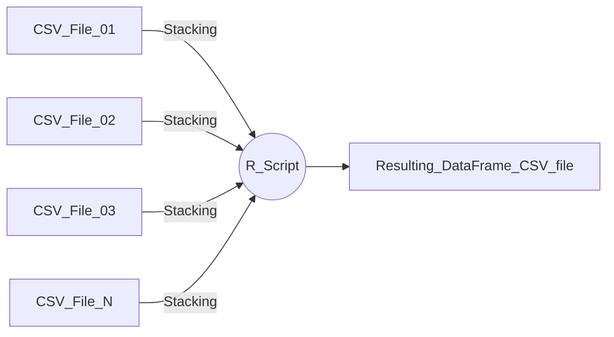

## Description 

This post depicts situations when data is collected in separate fragments, such as different time periods, places, or other subsets, and needs to be consolidated into a unified table for comprehensive analysis. This process is also known as "stacking" tables. Combining these individual data parts is essential to perform in-depth data processing and obtain insights that encompass the entirety of the original files.

The script automates the stacking process, resulting in significant time savings and error prevention, particularly when managing a substantial number of files.

The provided R script begins by collecting CSV files with the same structure (fields) from a specific folder. The script also enhances data integrity by modifying column names and introducing a "PPL" column that indicates the period for each record. The process concludes by exporting the consolidated dataset for further utilization in a CSV format.

## Link to the Complete Script in Github
[R Script - Stacking CSV files with equal structure](https://github.com/albarey33/Data_Analysis_R/blob/main/03%20Merging%20CSV%20files%20equal%20structure.R)


## Graphical Description of the Process

<!--{: width="832" height="505" }    
_<center>Merging Excel Files</center>_ -->



## Function Definition

This procedure uses the function _read.csv_ to merge the CSV files.

First the next function is developed. It takes three variables: 
* list_of_csv_files: List of file names to be imported.
* PPLini: Number of character where the period begins whithin the name.
* PPLfin: Number of character where the period finishes whithin the name.

```R

######### FUNCTION APPEND PPL CSV FILES  <<<<<<<<<<<<<<<<<<<<<<<<<<<<<<<<
fx_append_csvfiles <- function(list_of_csv_files, PPLini, PPLfin){
  mytypelist <- list() # Creation of empty list
  for(i in seq_along(list_of_csv_files)){
    df.list <- lapply(list_of_csv_files[i], read.csv)  ######### Convert list to Data frame 
    df.list[[1]]$PPL <- substr(list_of_csv_files[i], PPLini, PPLfin)
    print(paste(i," - Number of records in ",list_of_csv_files[i]," = ",
                nrow(df.list[[1]])," ; columns = ",length(df.list[[1]]),sep=""))
    mytypelist <- append(mytypelist, df.list)
  }
  mytypelist

}
```

## Read the downloaded csv files using full path and regex: 

```R
filenames_list <- list.files(path= path, full.names=TRUE, 
                             pattern=paste0("^Patient.*?",currPPL,"_1000pts.csv"))
filenames_list

# Locate the data month on the name
locPPL <- regexpr(currPPL,filenames_list[1])[1]  # Locate pattern in string

# Apply function
tibbles <- fx_append_csvfiles(filenames_list, locPPL, locPPL+5)
```


## Add Field with the Data Source File Name

Extract name from paths: basename

```R

for( i in seq_along(filenames_list)){
  tibbles[[i]]$FileName <- basename(filenames_list[i]) # list_files[i]
  }

```


__

End of Post

